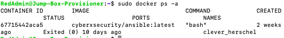

## Automated ELK Stack Deployment

The files in this repository were used to configure the network depicted below.

These files have been tested and used to generate a live ELK deployment on Azure. They can be used to either recreate the entire deployment pictured above. Alternatively, select portions of the pentest file may be used to install only certain pieces of it, such as Filebeat.

  - pentest.yml

This document contains the following details:
- Description of the Topology
- Access Policies
- ELK Configuration
  - Beats in Use
  - Machines Being Monitored
- How to Use the Ansible Build

### Description of the Topology

The main purpose of this network is to expose a load-balanced and monitored instance of DVWA, the Damn Vulnerable Web Application.

Load balancing ensures that the application will be highly efficient in addition to restricting traffic to the network.
- The security ascpect that load balancers protct is Denail of Sevice Attacks (DoS). The advantage of a jump box is that it helps to isolate privileged assets so that they are not directly in contact with potentially compromised workstations.

Integrating an ELK server allows users to easily monitor the vulnerable VMs for changes to the _____ and system _____.
- Filebeat is a lightweight shipper for forwarding and centralizing log data. Installed as an agent on your servers, Filebeat monitors the log files or locations that you specify, collects log events, and forwards them either to Elasticsearch or Logstash for indexing.
- Metricbeat takes the metrics and statistics that it collects and ships them to the output that you specify, such as Elasticsearch or Logstash

The configuration details of each machine may be found below.
_Note: Use the [Markdown Table Generator](http://www.tablesgenerator.com/markdown_tables) to add/remove values from the table_.

| Name          | Function      | IP Address | Operating System |
|---------------|---------------|------------|------------------|
| Jump Box      | Gateway       | 10.0.0.1   | Linux            |
| Web-1         | DVWA Container| 10.0.0.5   | Linux            |
| Web-2         | DVWA Container| 10.0.0.6   | Linux            |
| ELK-SERVER    | Server        | 10.1.0.4   | Linux            |

### Access Policies

The machines on the internal network are not exposed to the public Internet. 

Only the Jump box machine can accept connections from the Internet. Access to this machine is only allowed from the following IP addresses:
- 110.175.190.61

Machines within the network can only be accessed by SSH.
- The Jump Box is allowed access the ELK machine. The IP address allowed to access the ELK Server is 110.175.190.61

A summary of the access policies in place can be found in the table below.

| Name      | Publicly Accessible | Allowed IP Addresses |
|-----------|---------------------|----------------------|
| Jump Box  | Yes                 | 10.0.0.1 10.0.0.2    |
| ELK Server| No                  |                      |

### Elk Configuration

Ansible was used to automate configuration of the ELK machine. No configuration was performed manually, which is advantageous because...
- Ansible makes it easy to read and supports comments. Most important of all, it also includes the use of anchors to reference other items.

The playbook implements the following tasks:
- Install docker container 
- Install python3-pip
- Install docker pip module
- Download and launch a docker elk container by opening ports: 5601, 9200, 5044
- Enable docker service

The following screenshot displays the result of running `docker ps` after successfully configuring the ELK instance.

### Target Machines & Beats
This ELK server is configured to monitor the following machines:
- Web-1 IP address 10.0.0.5
- Web-2 IP address 10.0.0.6

We have installed the following Beats on these machines:
- Winlogbeat

These Beats allow us to collect the following information from each machine:
- `Winlogbeat` collects Windows logs, which we use to track user logon events.

### Using the Playbook
In order to use the playbook, you will need to have an Ansible control node already configured. Assuming you have such a control node provisioned: 

SSH into the control node and follow the steps below:
- Copy the pentest file to /etc/ansible folder.
- Update the pentest.yml file to include...
- Run the playbook, and navigate to Kibana to check that the installation worked as expected.
